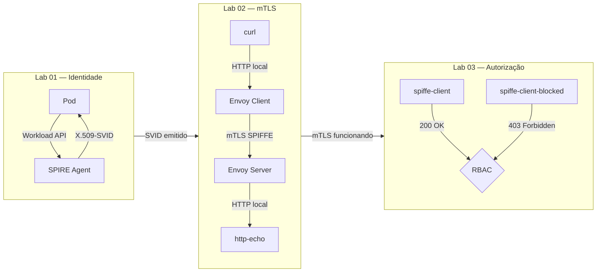

## Workload Identity Lab - SPIFFE/SPIRE


Laboratório prático e progressivo de identidade de workloads com SPIFFE e SPIRE em Kubernetes local (Minikube).

Cada lab constrói sobre o anterior, partindo da emissão básica de identidade até autorização granular baseada em SPIFFE ID.

---

## Estrutura

```text
spiffespire-lab/
├── README.md                        ← este arquivo
├── lab01-svid-basic/
│   ├── README.md
│   └── spiffe-client.yaml
├── lab02-mtls-envoy/
│   ├── README.md
│   ├── envoy-client-config.yaml
│   ├── envoy-server-config.yaml
│   ├── mtls-client.yaml
│   └── mtls-server.yaml
└── lab03-spiffe-id-authorization/
    ├── README_lab03.md
    ├── envoy-client-config.yaml
    ├── envoy-client-blocked-config.yaml
    ├── envoy-server-config.yaml
    ├── mtls-client.yaml
    ├── mtls-client-blocked.yaml
    └── mtls-server.yaml
```

---

## Labs

| Lab | Objetivo | Conceito central |
|-----|----------|-----------------|
| [Lab 01](./lab01-svid-basic/README.md) | Emissão de identidade SPIFFE via Workload API | X.509-SVID |
| [Lab 02](./lab02-mtls-envoy/README.md) | Comunicação mTLS entre workloads com Envoy + SPIRE SDS | mTLS transparente |
| [Lab 03](./lab03-spiffe-id-authorization/README_lab03.md) | Autorização baseada em SPIFFE ID via RBAC do Envoy | Autenticação ≠ Autorização |

---

## Diagrama geral



Esta arquitetura mostra a evolução do laboratório em três etapas.

No **Lab 01**, o objetivo é validar a identidade da workload. Um pod no Kubernetes acessa a Workload API do SPIRE Agent e recebe um certificado de identidade chamado **X.509-SVID**. Esse certificado contém o **SPIFFE ID**, que funciona como uma identidade única da aplicação dentro do ambiente. Em termos simples, é como se o pod recebesse um “crachá digital” confiável dizendo quem ele é.

No **Lab 02**, essa identidade passa a ser usada para proteger a comunicação entre serviços. O cliente faz uma chamada HTTP local para o seu Envoy sidecar. O Envoy do cliente usa o certificado emitido pelo SPIRE para abrir uma conexão **mTLS** com o Envoy do servidor. O servidor, por sua vez, valida se o certificado apresentado pelo cliente é confiável. Se a validação for bem-sucedida, a chamada é encaminhada para a aplicação `http-echo`. Dessa forma, a comunicação entre os serviços ocorre de forma segura, sem depender de certificados estáticos configurados manualmente.

No **Lab 03**, além de autenticar a comunicação, a arquitetura passa a controlar quem pode acessar o serviço. Mesmo que uma workload tenha um certificado válido, ela só será aceita se o seu **SPIFFE ID** estiver autorizado pela regra RBAC do Envoy. No exemplo, o `spiffe-client` é permitido e recebe resposta `200 OK`, enquanto o `spiffe-client-blocked` é negado e recebe `403 Forbidden`.

Em resumo, a arquitetura demonstra três capacidades principais: primeiro, emitir identidade para workloads; depois, usar essa identidade para comunicação segura via mTLS; e por fim, aplicar autorização baseada na identidade da workload. Isso representa um modelo moderno de segurança, onde aplicações são identificadas e autorizadas dinamicamente, sem depender de senhas ou certificados fixos dentro dos pods.

---

## Versões utilizadas

| Componente | Versão |
|------------|--------|
| SPIRE (Server + Agent) | 1.14.5 |
| Envoy | v1.31-latest |
| curl image | curlimages/curl:8.10.1 |
| http-echo | hashicorp/http-echo:1.0 |
| Minikube | qualquer versão recente |
| Kubernetes | 1.28+ recomendado |

## Pré-requisitos gerais

Antes de qualquer lab, você precisa ter:

- [Minikube](https://minikube.sigs.k8s.io/) instalado e em execução
- `kubectl` configurado e apontando para o Minikube
- SPIRE instalado via Helm no namespace `spire`
- SPIFFE CSI Driver instalado

Validar:

```bash
kubectl get pods -n spire
```

Todos os pods devem estar em estado `Running`.

---

## Conceito essencial: Workload Entry

Antes de qualquer workload receber um SVID, ela precisa estar registrada no SPIRE Server.

Esse passo é obrigatório e deve ser feito antes de executar qualquer lab.

Cada lab documenta os comandos específicos de registro na sua própria seção de pré-requisitos.

---

## Trust Domain

O trust domain usado em todos os labs é:

```text
example.org
```

Os SPIFFE IDs seguem o padrão:

```text
spiffe://example.org/ns/<namespace>/sa/<service-account>
```

---

## Ordem recomendada

Execute os labs em ordem:

```text
Lab 01 → Lab 02 → Lab 03
```

O Lab 01 valida que o ambiente está funcionando antes de avançar para mTLS e autorização.
