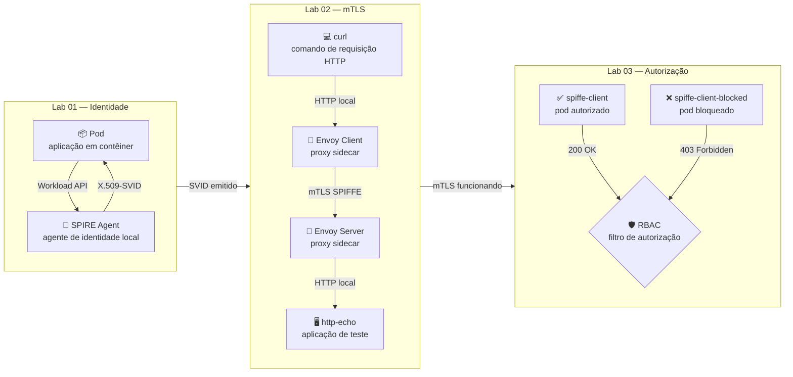

<p align="center">
  
</p>

<h1 align="center">🔐 Workload Identity Lab — SPIFFE/SPIRE</h1>

<p align="center">
  <code>SPIRE 1.14.5</code> &nbsp;·&nbsp; <code>Envoy v1.31</code> &nbsp;·&nbsp; <code>Kubernetes 1.28+</code> &nbsp;·&nbsp; <code>Minikube</code>
</p>

Laboratório prático e progressivo de identidade de workloads — aplicações e serviços rodando em contêiner — com SPIFFE e SPIRE em Kubernetes local (Minikube).

Cada lab constrói sobre o anterior, partindo da emissão básica de identidade até autorização granular baseada em SPIFFE ID.

---

## 📁 Estrutura

```text
spiffespire-lab/
├── README.md                        ← este arquivo
├── lab01-svid-basic/
│   ├── README.md
│   └── spiffe-client.yaml
├── lab02-mtls-envoy/
│   ├── README.md
│   ├── envoy-client-config.yaml
│   ├── envoy-server-config.yaml
│   ├── mtls-client.yaml
│   └── mtls-server.yaml
└── lab03-spiffe-id-authorization/
    ├── README_lab03.md
    ├── envoy-client-config.yaml
    ├── envoy-client-blocked-config.yaml
    ├── envoy-server-config.yaml
    ├── mtls-client.yaml
    ├── mtls-client-blocked.yaml
    └── mtls-server.yaml
```

---

## 🧪 Labs

| # | Lab | Objetivo | Conceito central |
|---|-----|----------|-----------------|
| 1️⃣ | [Lab 01](./lab01-svid-basic/README.md) | Emissão de identidade SPIFFE via Workload API | X.509-SVID |
| 2️⃣ | [Lab 02](./lab02-mtls-envoy/README.md) | Comunicação mTLS entre workloads com Envoy + SPIRE SDS | mTLS transparente |
| 3️⃣ | [Lab 03](./lab03-spiffe-id-authorization/README_lab03.md) | Autorização baseada em SPIFFE ID via RBAC do Envoy | Autenticação ≠ Autorização |

---

## 🗺️ Diagrama geral



**Legenda:**

| Ícone | Elemento | O que é |
|-------|----------|---------|
| 📦 | Pod | Unidade de execução do Kubernetes — onde a aplicação roda |
| 🔐 | SPIRE Agent | Processo local responsável por emitir e renovar certificados |
| 💻 | curl | Ferramenta de linha de comando para fazer requisições HTTP |
| 🔀 | Envoy | Proxy sidecar que intercepta e protege o tráfego de rede |
| 🖥️ | http-echo | Aplicação de teste que ecoa a requisição recebida |
| ✅ | spiffe-client | Pod com SPIFFE ID autorizado pela política RBAC |
| ❌ | spiffe-client-blocked | Pod com SPIFFE ID bloqueado pela política RBAC |
| 🛡️ | RBAC | Filtro de autorização que decide quem pode acessar o serviço |

---

Esta arquitetura mostra a evolução do laboratório em três etapas.

No **Lab 01**, o objetivo é validar a identidade da workload. Um pod no Kubernetes acessa a Workload API do SPIRE Agent e recebe um certificado de identidade chamado **X.509-SVID**. Esse certificado contém o **SPIFFE ID**, que funciona como uma identidade única da aplicação dentro do ambiente. Em termos simples, é como se o pod recebesse um "crachá digital" confiável dizendo quem ele é.

No **Lab 02**, essa identidade passa a ser usada para proteger a comunicação entre serviços. O cliente faz uma chamada HTTP local para o seu **Envoy sidecar** — um contêiner auxiliar que roda junto à aplicação no mesmo pod e intercepta o tráfego de rede. O Envoy do cliente usa o certificado emitido pelo SPIRE para abrir uma conexão **mTLS** (mutual TLS — onde tanto o cliente quanto o servidor se autenticam mutuamente apresentando certificados) com o Envoy do servidor. O servidor valida se o certificado do cliente é confiável e, se for, encaminha a chamada para a aplicação `http-echo`. Dessa forma, a comunicação entre os serviços ocorre de forma segura, sem depender de certificados estáticos configurados manualmente.

No **Lab 03**, além de autenticar a comunicação, a arquitetura passa a controlar quem pode acessar o serviço. Mesmo que uma workload tenha um certificado válido, ela só será aceita se o seu **SPIFFE ID** estiver autorizado pela regra **RBAC** (Role-Based Access Control — controle de acesso baseado na identidade da workload) configurada no Envoy. No exemplo, o `spiffe-client` é permitido e recebe resposta `200 OK`, enquanto o `spiffe-client-blocked` é negado e recebe `403 Forbidden`.

Em resumo, a arquitetura demonstra três capacidades principais: emitir identidade para workloads, usar essa identidade para comunicação segura via mTLS e aplicar autorização baseada na identidade. Isso representa um modelo moderno de segurança onde aplicações são identificadas e autorizadas dinamicamente, sem depender de senhas ou certificados fixos dentro dos pods.

---

## 🔑 Conceito essencial: Workload Entry

Uma **Workload Entry** é um registro no SPIRE Server que declara: _"este pod, identificado por este namespace e esta ServiceAccount, está autorizado a receber um SVID com este SPIFFE ID"_.

Sem esse registro, o SPIRE Agent ignora qualquer pedido de certificado que chegue do pod, mesmo que ele esteja rodando corretamente.

> [!IMPORTANT]
> Esse passo é obrigatório e deve ser feito antes de executar qualquer lab.

Cada lab documenta os comandos específicos de registro na sua própria seção de pré-requisitos.

---

## 🌐 Trust Domain

O **trust domain** é o domínio de confiança do ambiente SPIFFE — funciona como o "sobrenome" de todas as identidades emitidas pelo mesmo SPIRE Server. Qualquer SPIFFE ID sempre começa com `spiffe://` seguido do trust domain.

O trust domain usado em todos os labs é:

```text
example.org
```

Os SPIFFE IDs seguem o padrão:

```text
spiffe://example.org/ns/<namespace>/sa/<service-account>
```

---

## ✅ Pré-requisitos gerais

Antes de qualquer lab, você precisa ter:

- [ ] [Minikube](https://minikube.sigs.k8s.io/) instalado e em execução
- [ ] `kubectl` configurado e apontando para o Minikube
- [ ] SPIRE instalado via Helm no namespace `spire`
- [ ] SPIFFE CSI Driver instalado

Validar:

```bash
kubectl get pods -n spire
```

> Todos os pods devem estar em estado `Running`.

---

## ⚙️ Versões utilizadas

| Componente | Versão |
|------------|--------|
| SPIRE (Server + Agent) | 1.14.5 |
| Envoy | v1.31-latest |
| curl image | curlimages/curl:8.10.1 |
| http-echo | hashicorp/http-echo:1.0 |
| Minikube | qualquer versão recente |
| Kubernetes | 1.28+ recomendado |

---

## 🚀 Ordem recomendada

Execute os labs em ordem:

```text
Lab 01 → Lab 02 → Lab 03
```

> O Lab 01 valida que o ambiente está funcionando antes de avançar para mTLS e autorização.
