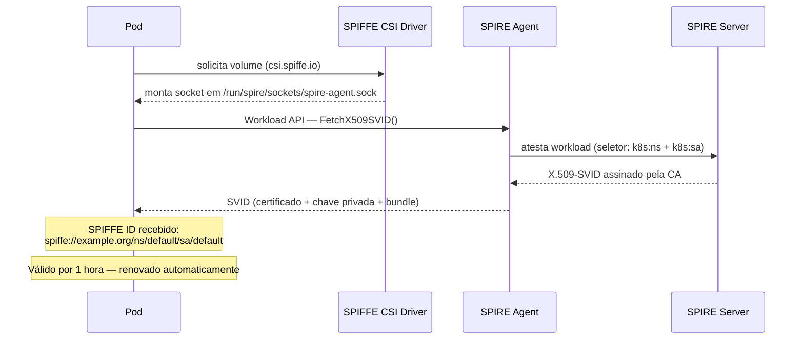

# Lab 01 — Validação básica de SVID com SPIFFE/SPIRE

Este laboratório valida a emissão de identidade para uma workload Kubernetes.

O objetivo é confirmar que um pod consegue acessar a **SPIFFE Workload API** via socket e receber um **X.509-SVID** emitido pelo SPIRE.

---

## 1. Objetivo

Validar o fluxo básico:

```text
Pod Kubernetes
   ↓
SPIFFE CSI Driver monta o socket
   ↓
Workload acessa o SPIRE Agent via Workload API
   ↓
SPIRE Agent entrega um X.509-SVID
   ↓
Workload recebe um SPIFFE ID
```

Resultado esperado:

```text
SPIFFE ID: spiffe://example.org/ns/default/sa/default
```

---

## 2. Diagrama — Fluxo de emissão do SVID



---

## 3. Conceitos envolvidos

### SPIFFE ID

Identidade única da workload. Neste lab:

```text
spiffe://example.org/ns/default/sa/default
```

| Campo | Valor |
|-------|-------|
| Trust Domain | example.org |
| Namespace | default |
| ServiceAccount | default |

### X.509-SVID

Certificado X.509 emitido pelo SPIRE que carrega a identidade SPIFFE da workload.
Válido por padrão por **1 hora**, renovado automaticamente pelo SPIRE Agent.

### Workload API

Interface local acessada via socket Unix:

```text
/run/spire/sockets/spire-agent.sock
```

---

## 3. Pré-requisitos

- Minikube rodando
- SPIRE instalado no namespace `spire` (Server + Agent + CSI Driver)

Validar:

```bash
kubectl get pods -n spire
```

---

## 4. Registrar a Workload Entry no SPIRE Server

> ⚠️ **Este passo é obrigatório.** Sem o registro, o pod não receberá nenhum SVID.

Obtenha o UID do node:

```bash
kubectl get node minikube -o jsonpath='{.metadata.uid}'
```

Registre a workload no SPIRE Server (substitua `<NODE_UID>` pelo valor obtido):

```bash
kubectl exec -n spire spire-server-0 -- \
  /opt/spire/bin/spire-server entry create \
  -spiffeID spiffe://example.org/ns/default/sa/default \
  -parentID spiffe://example.org/spire/agent/k8s_sat/minikube/<NODE_UID> \
  -selector k8s:ns:default \
  -selector k8s:sa:default
```

Confirme que a entry foi criada:

```bash
kubectl exec -n spire spire-server-0 -- \
  /opt/spire/bin/spire-server entry show
```

---

## 5. Arquivo do lab

```text
lab01-svid-basic/
└── spiffe-client.yaml
```

Cria um pod chamado `spiffe-client` no namespace `default` com a ServiceAccount `default`.

O pod usa a imagem `ghcr.io/spiffe/spire-agent:1.14.5` e executa:

```bash
/opt/spire/bin/spire-agent api watch \
  -socketPath /run/spire/sockets/spire-agent.sock
```

---

## 6. Como executar

```bash
kubectl apply -f lab01-svid-basic/spiffe-client.yaml
```

Valide o pod:

```bash
kubectl get pod spiffe-client
```

Resultado esperado:

```text
NAME            READY   STATUS    RESTARTS   AGE
spiffe-client   1/1     Running   0          Xs
```

---

## 7. Validar o SVID pelos logs

```bash
kubectl logs spiffe-client -c client
```

Exemplo de saída esperada do `api watch`:

```text
time="..." level=info msg="SVID updated" spiffe_id="spiffe://example.org/ns/default/sa/default"
SPIFFE ID:    spiffe://example.org/ns/default/sa/default
SVID Valid After:  2024-01-01T00:00:00Z
SVID Valid Until:  2024-01-01T01:00:00Z  ← válido por 1 hora
```

> O SPIRE Agent renova o SVID automaticamente antes da expiração. Não é necessário reiniciar o pod.

---

## 8. Validar o SVID manualmente com fetch

```bash
kubectl exec -it spiffe-client -c client -- \
  /opt/spire/bin/spire-agent api fetch \
  -socketPath /run/spire/sockets/spire-agent.sock
```

Resultado esperado:

```text
SPIFFE ID:         spiffe://example.org/ns/default/sa/default
SVID Valid After:  ...
SVID Valid Until:  ...
```

---

## 9. O que foi validado

```text
1. SPIRE Server está funcionando
2. SPIRE Agent está funcionando
3. CSI Driver montou o socket corretamente no pod
4. Workload acessou a Workload API
5. Workload recebeu um X.509-SVID válido
6. Identidade SPIFFE foi emitida com sucesso
```

---

## 10. Parar o Lab 01

```bash
kubectl delete -f lab01-svid-basic/spiffe-client.yaml
```

---

## 11. Troubleshooting

### Socket não encontrado

```text
no such file or directory: /run/spire/sockets/agent.sock
```

O socket correto neste ambiente é:

```text
/run/spire/sockets/spire-agent.sock
```

Confirme no YAML que esse caminho está sendo usado.

### Pod em CrashLoopBackOff

```bash
kubectl logs spiffe-client -c client --previous
kubectl describe pod spiffe-client
```

### SVID não recebido (sem output no watch)

Verifique se a Workload Entry foi registrada corretamente:

```bash
kubectl exec -n spire spire-server-0 -- \
  /opt/spire/bin/spire-server entry show
```

Se estiver vazio, a entry não foi criada. Repita o passo 4.

### Verificar se o socket foi montado

```bash
kubectl exec -it spiffe-client -c client -- \
  ls -la /run/spire/sockets
```

O esperado é encontrar o arquivo `spire-agent.sock`.

### SVID expirado durante testes

O SVID tem validade de 1 hora por padrão. Se o pod ficar parado por muito tempo, o Agent renova automaticamente. Se o Agent estiver com problemas, reinicie:

```bash
kubectl rollout restart daemonset spire-agent -n spire
```

---

## 12. Próximo lab

Após validar a emissão do SVID, siga para:

```text
lab02-mtls-envoy/
```

Nele, o SPIFFE ID será usado para estabelecer comunicação **mTLS real** entre dois pods com Envoy sidecar.
