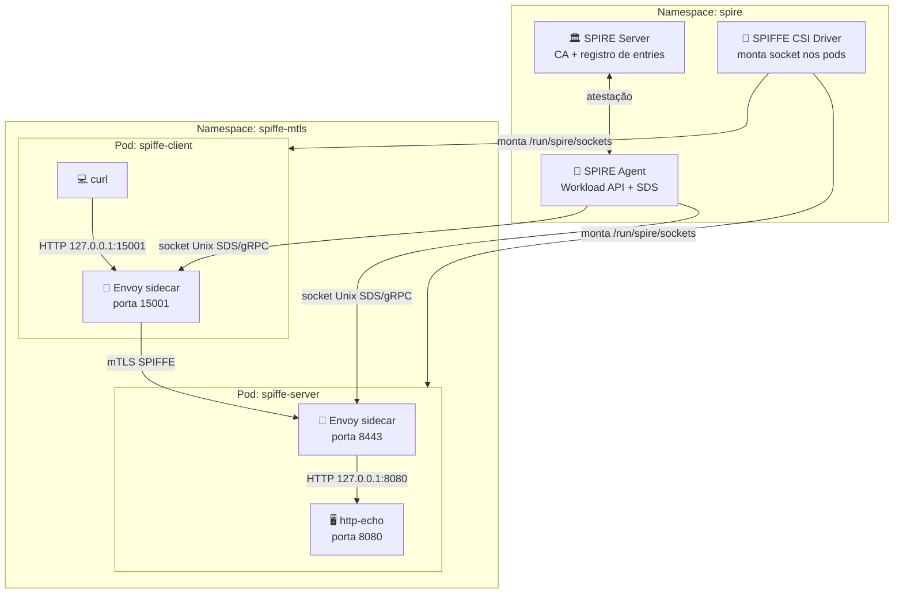
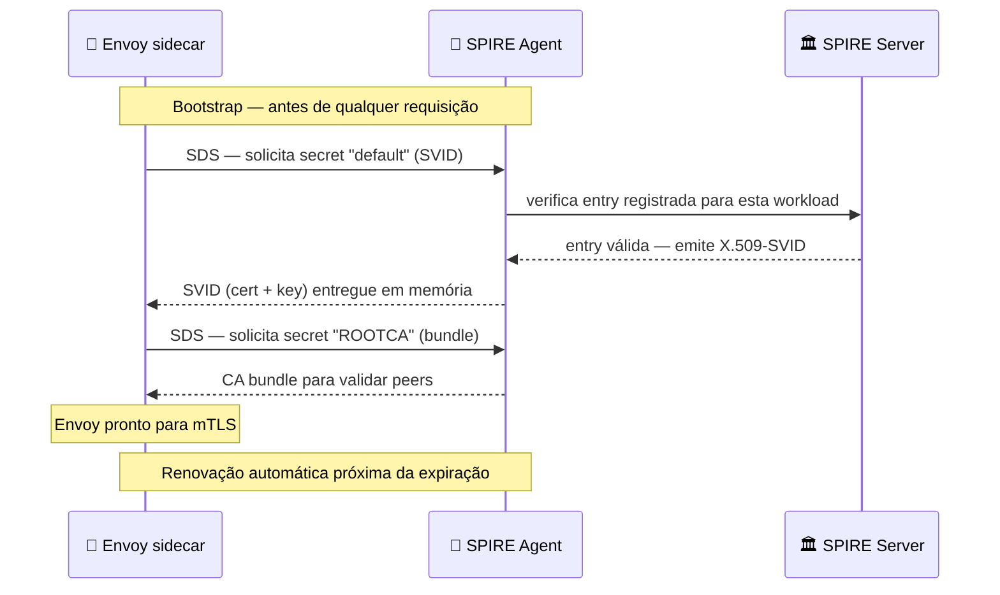
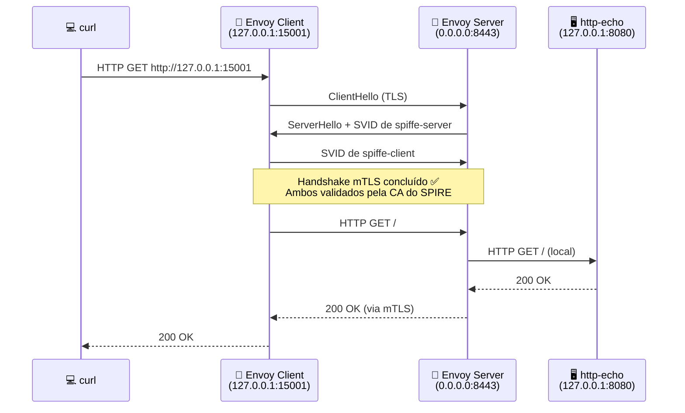

# 🔒 Lab 02 — Comunicação mTLS com SPIFFE/SPIRE e Envoy

> **Progresso:** [Lab 01](../lab01-svid-basic/README.md) → `Lab 02` → [Lab 03](../lab03-spiffe-id-authorization/README_lab03.md)

Este lab valida a comunicação **mTLS** (mutual TLS — onde tanto o cliente quanto o servidor se autenticam mutuamente apresentando certificados) entre dois pods. Os certificados de ambos os lados são X.509-SVIDs emitidos pelo SPIRE, e o **Envoy sidecar** — um contêiner auxiliar que roda junto à aplicação no mesmo pod — cuida de toda a negociação TLS de forma transparente.

> [!NOTE]
> Pré-requisito: ter concluído o [Lab 01](../lab01-svid-basic/README.md) e validado que o SPIRE está emitindo SVIDs corretamente.

---

## 1. 🎯 Objetivo

Validar que dois serviços conseguem se comunicar usando **mTLS real**, onde:

- Os certificados de ambos os lados são X.509-SVIDs emitidos pelo SPIRE
- O Envoy sidecar intercepta o tráfego e negocia o TLS de forma transparente para a aplicação
- A aplicação não precisa saber nada sobre certificados — isso é responsabilidade do Envoy

---

## 2. 🪪 Identidades usadas

| Pod | ServiceAccount | SPIFFE ID |
|-----|---------------|-----------|
| spiffe-client | spiffe-client | spiffe://example.org/ns/spiffe-mtls/sa/spiffe-client |
| spiffe-server | spiffe-server | spiffe://example.org/ns/spiffe-mtls/sa/spiffe-server |

---

## 3. 🏗️ Arquitetura

### Visão geral dos componentes



---

### Como o Envoy obtém os certificados via SDS

O Envoy busca os certificados dinamicamente via **SDS** (Secret Discovery Service — protocolo pelo qual o Envoy solicita segredos, como certificados, diretamente do SPIRE Agent em tempo real).



**Legenda:**

| Ícone | Elemento | O que é |
|-------|----------|---------|
| 🏛️ | SPIRE Server | Autoridade central que assina os certificados (CA) |
| 🔐 | SPIRE Agent | Agente local que distribui SVIDs via SDS |
| 🔌 | SPIFFE CSI Driver | Monta o socket SPIFFE dentro de cada pod |
| 💻 | curl | Ferramenta de linha de comando para requisições HTTP |
| 🔀 | Envoy | Proxy sidecar que negocia o mTLS entre os pods |
| 🖥️ | http-echo | Aplicação de teste que responde às requisições |

O Envoy **não lê certificados do disco**. Os SVIDs são entregues em memória pelo SPIRE Agent e renovados automaticamente — sem necessidade de reiniciar o pod.

---

### Fluxo completo da requisição mTLS



---

## 4. 📁 Arquivos do lab

```text
lab02-mtls-envoy/
├── envoy-client-config.yaml   ← ConfigMap com config do Envoy do cliente
├── envoy-server-config.yaml   ← ConfigMap com config do Envoy do servidor
├── mtls-client.yaml           ← Pod: curl + Envoy sidecar
└── mtls-server.yaml           ← Service + Pod: http-echo + Envoy sidecar
```

---

## 5. ✅ Pré-requisitos

- [ ] Minikube rodando
- [ ] SPIRE instalado e funcionando no namespace `spire`
- [ ] Lab 01 concluído com sucesso

---

## 6. 🔑 Registrar as Workload Entries no SPIRE Server

> [!IMPORTANT]
> **Este passo é obrigatório.** Sem o registro, nenhum pod receberá SVID e o mTLS não funcionará.

Obtenha o UID do node:

```bash
kubectl get node minikube -o jsonpath='{.metadata.uid}'
```

Registre o cliente (substitua `<NODE_UID>`):

```bash
kubectl exec -n spire spire-server-0 -- \
  /opt/spire/bin/spire-server entry create \
  -spiffeID spiffe://example.org/ns/spiffe-mtls/sa/spiffe-client \
  -parentID spiffe://example.org/spire/agent/k8s_sat/minikube/<NODE_UID> \
  -selector k8s:ns:spiffe-mtls \
  -selector k8s:sa:spiffe-client
```

Registre o servidor:

```bash
kubectl exec -n spire spire-server-0 -- \
  /opt/spire/bin/spire-server entry create \
  -spiffeID spiffe://example.org/ns/spiffe-mtls/sa/spiffe-server \
  -parentID spiffe://example.org/spire/agent/k8s_sat/minikube/<NODE_UID> \
  -selector k8s:ns:spiffe-mtls \
  -selector k8s:sa:spiffe-server
```

Confirme as entries:

```bash
kubectl exec -n spire spire-server-0 -- \
  /opt/spire/bin/spire-server entry show
```

---

## 7. 🗂️ Criar namespace e ServiceAccounts

```bash
kubectl create namespace spiffe-mtls

kubectl create serviceaccount spiffe-client -n spiffe-mtls
kubectl create serviceaccount spiffe-server -n spiffe-mtls
```

---

## 8. ▶️ Aplicar os manifests

```bash
kubectl apply -f lab02-mtls-envoy/envoy-server-config.yaml
kubectl apply -f lab02-mtls-envoy/envoy-client-config.yaml
kubectl apply -f lab02-mtls-envoy/mtls-server.yaml
kubectl apply -f lab02-mtls-envoy/mtls-client.yaml
```

---

## 9. 🔍 Validar os pods

```bash
kubectl get pods -n spiffe-mtls
```

Resultado esperado:

```text
NAME            READY   STATUS    RESTARTS   AGE
spiffe-client   2/2     Running   0          Xs
spiffe-server   2/2     Running   0          Xs
```

> Cada pod tem 2 containers: a aplicação e o Envoy sidecar.

---

## 10. 🧪 Testar a comunicação mTLS

```bash
kubectl exec -it -n spiffe-mtls spiffe-client -c curl -- \
  curl -v http://127.0.0.1:15001
```

Resultado esperado:

```text
HTTP/1.1 200 OK

Resposta do servidor protegida por mTLS SPIFFE
```

> Isso confirma que o mTLS foi estabelecido com sucesso usando identidades SPIFFE.

---

## 11. 🛠️ Debug com o Envoy Admin (porta 9901)

O Envoy expõe uma interface de administração em `127.0.0.1:9901` dentro de cada pod, útil para inspecionar o estado interno do proxy.

Verificar os certificados ativos no cliente:

```bash
kubectl exec -it -n spiffe-mtls spiffe-client -c envoy -- \
  wget -qO- http://127.0.0.1:9901/certs
```

Verificar os clusters configurados:

```bash
kubectl exec -it -n spiffe-mtls spiffe-client -c envoy -- \
  wget -qO- http://127.0.0.1:9901/clusters
```

Verificar estatísticas de conexão:

```bash
kubectl exec -it -n spiffe-mtls spiffe-client -c envoy -- \
  wget -qO- http://127.0.0.1:9901/stats | grep ssl
```

---

## 12. 🛑 Parar o Lab 02

```bash
kubectl delete -f lab02-mtls-envoy/mtls-client.yaml
kubectl delete -f lab02-mtls-envoy/mtls-server.yaml
kubectl delete -f lab02-mtls-envoy/envoy-client-config.yaml
kubectl delete -f lab02-mtls-envoy/envoy-server-config.yaml
```

Para remover o namespace inteiro:

```bash
kubectl delete namespace spiffe-mtls
```

---

## 13. 🔧 Troubleshooting

### Envoy não sobe: node id e cluster obrigatórios

```text
TlsCertificateSdsApi: node 'id' and 'cluster' are required
```

Confirme que os YAMLs do Envoy possuem a seção `node` com `id` e `cluster`:

```yaml
node:
  id: spiffe-client
  cluster: spiffe-mtls
```

### Envoy não recebe SVID do SPIRE

Verifique se o socket está montado corretamente no pod:

```bash
kubectl exec -it -n spiffe-mtls spiffe-client -c envoy -- \
  ls -la /run/spire/sockets
```

Deve aparecer `spire-agent.sock`. Se não aparecer, o CSI Driver não montou o volume.

### curl retorna connection refused

Verifique os logs do Envoy do cliente:

```bash
kubectl logs -n spiffe-mtls spiffe-client -c envoy
```

E do servidor:

```bash
kubectl logs -n spiffe-mtls spiffe-server -c envoy
```

### Workload Entry não listada

```bash
kubectl exec -n spire spire-server-0 -- \
  /opt/spire/bin/spire-server entry show
```

Se as entries de `spiffe-client` e `spiffe-server` não aparecerem, repita o passo 6.

### Conversão de path no Git Bash (Windows)

Se estiver usando Git Bash no Windows e os paths estiverem sendo convertidos indevidamente:

```bash
export MSYS_NO_PATHCONV=1
```

---

## 14. ➡️ Próximo lab

Após validar o mTLS, siga para:

> [**Lab 03 — Autorização baseada em SPIFFE ID →**](../lab03-spiffe-id-authorization/README_lab03.md)

Nele, o servidor passa a verificar **qual SPIFFE ID está autorizado** a acessar a aplicação, adicionando uma camada de autorização sobre o mTLS já estabelecido.
