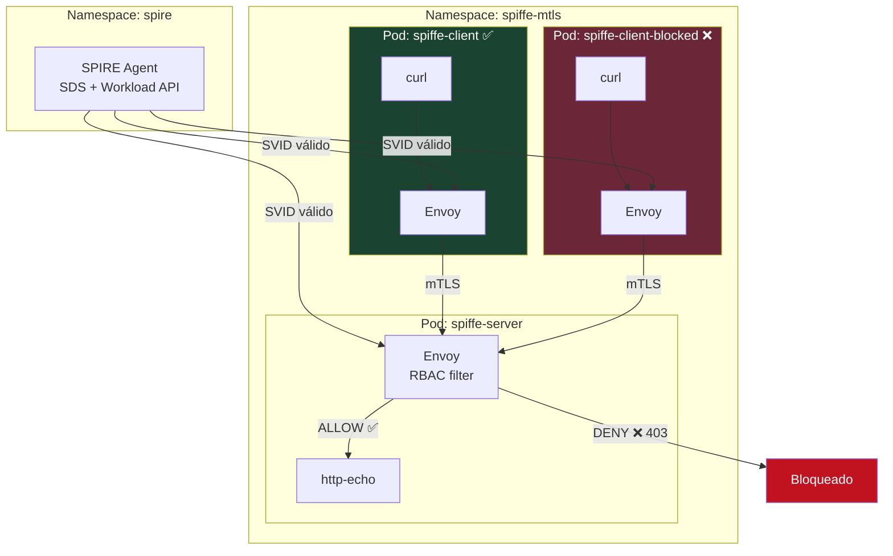
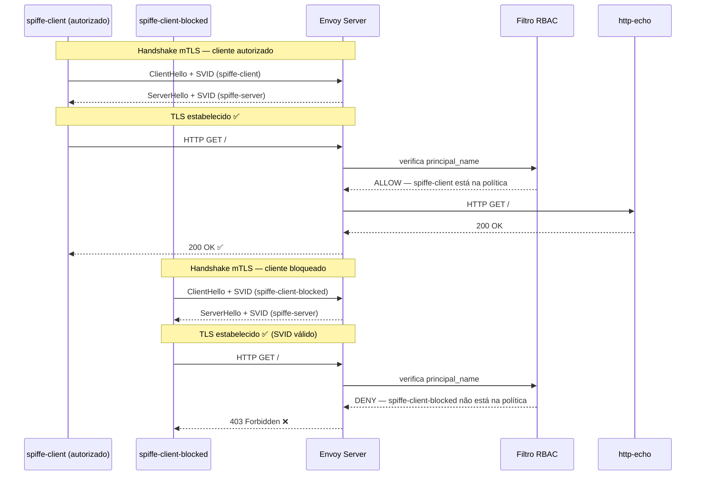

# Lab 03 — Autorização baseada em SPIFFE ID

Este lab evolui o cenário do **Lab 02**, adicionando uma camada de **autorização baseada em identidade SPIFFE**.

No Lab 02, foi validado que dois serviços conseguem se comunicar com mTLS. Neste Lab 03, o servidor passa a verificar **qual SPIFFE ID está autorizado** a acessar a aplicação — separando claramente autenticação de autorização.

> Pré-requisito: ter concluído o [Lab 02](../lab02-mtls-envoy/README.md).

---

## 1. Objetivo

Validar o seguinte cenário:

```text
mTLS autenticado + autorização baseada em SPIFFE ID
```

- O cliente precisa apresentar um SVID válido (mTLS)
- O Envoy Server verifica o SPIFFE ID do cliente via RBAC
- Apenas o SPIFFE ID autorizado recebe `200 OK`
- Qualquer outro SPIFFE ID recebe `403 Forbidden`, mesmo com SVID válido

---

## 2. Conceito central: autenticação ≠ autorização

O mTLS estabelece **quem é** a workload — valida a cadeia de confiança do SPIRE e confirma a identidade.

O RBAC decide **o que ela pode fazer** — mesmo com identidade válida, o acesso pode ser negado.

### Onde o RBAC acontece

O RBAC é aplicado na **camada HTTP**, não na camada TLS.

Isso significa que:

```text
spiffe-client-blocked
   ↓
Handshake mTLS tem SUCESSO (SVID válido, CA correta)
   ↓
Envoy Server verifica o SPIFFE ID no filtro RBAC (camada HTTP)
   ↓
SPIFFE ID não autorizado → HTTP 403 Forbidden
```

O cliente bloqueado **consegue abrir a conexão TLS**, mas a requisição HTTP é rejeitada. Esse é o ponto-chave do lab.

---

## 3. Identidades usadas

| Pod | ServiceAccount | SPIFFE ID | Resultado |
|-----|---------------|-----------|-----------|
| spiffe-client | spiffe-client | spiffe://example.org/ns/spiffe-mtls/sa/spiffe-client | ✅ 200 OK |
| spiffe-server | spiffe-server | spiffe://example.org/ns/spiffe-mtls/sa/spiffe-server | — (servidor) |
| spiffe-client-blocked | spiffe-client-blocked | spiffe://example.org/ns/spiffe-mtls/sa/spiffe-client-blocked | ❌ 403 Forbidden |

---

## 4. Diagrama de arquitetura

### Visão geral — dois clientes, uma decisão



---

### Fluxo de decisão do RBAC



> O handshake TLS **tem sucesso nos dois casos**. A rejeição acontece na camada HTTP, pelo filtro RBAC — não pelo TLS.

---

## 5. Política RBAC aplicada no Envoy Server

O filtro `envoy.filters.http.rbac` no `envoy-server-config.yaml` permite apenas:

```text
spiffe://example.org/ns/spiffe-mtls/sa/spiffe-client
```

Trecho da configuração:

```yaml
http_filters:
- name: envoy.filters.http.rbac
  typed_config:
    "@type": type.googleapis.com/envoy.extensions.filters.http.rbac.v3.RBAC
    rules:
      action: ALLOW
      policies:
        allow_only_spiffe_client:
          permissions:
          - any: true
          principals:
          - authenticated:
              principal_name:
                exact: "spiffe://example.org/ns/spiffe-mtls/sa/spiffe-client"
```

Qualquer outro SPIFFE ID não listado na política será bloqueado.

---

## 6. Arquivos do lab

```text
lab03-spiffe-id-authorization/
├── envoy-server-config.yaml        ← Envoy Server com mTLS + RBAC
├── envoy-client-config.yaml        ← Envoy do cliente autorizado
├── envoy-client-blocked-config.yaml← Envoy do cliente bloqueado
├── mtls-server.yaml                ← Service + Pod do servidor
├── mtls-client.yaml                ← Pod do cliente autorizado
└── mtls-client-blocked.yaml        ← Pod do cliente bloqueado
```

---

## 7. Pré-requisitos

- Minikube rodando
- SPIRE instalado no namespace `spire`
- Namespace `spiffe-mtls` criado
- Lab 02 concluído (ou pelo menos compreendido)

---

## 8. Registrar as Workload Entries no SPIRE Server

> ⚠️ **Este passo é obrigatório.** Sem o registro, nenhum pod recebe SVID.

Obtenha o UID do node:

```bash
kubectl get node minikube -o jsonpath='{.metadata.uid}'
```

Registre os três SVIDs (substitua `<NODE_UID>`):

```bash
# Cliente autorizado
kubectl exec -n spire spire-server-0 -- \
  /opt/spire/bin/spire-server entry create \
  -spiffeID spiffe://example.org/ns/spiffe-mtls/sa/spiffe-client \
  -parentID spiffe://example.org/spire/agent/k8s_sat/minikube/<NODE_UID> \
  -selector k8s:ns:spiffe-mtls \
  -selector k8s:sa:spiffe-client

# Servidor
kubectl exec -n spire spire-server-0 -- \
  /opt/spire/bin/spire-server entry create \
  -spiffeID spiffe://example.org/ns/spiffe-mtls/sa/spiffe-server \
  -parentID spiffe://example.org/spire/agent/k8s_sat/minikube/<NODE_UID> \
  -selector k8s:ns:spiffe-mtls \
  -selector k8s:sa:spiffe-server

# Cliente bloqueado (também recebe SVID válido, mas não está na política RBAC)
kubectl exec -n spire spire-server-0 -- \
  /opt/spire/bin/spire-server entry create \
  -spiffeID spiffe://example.org/ns/spiffe-mtls/sa/spiffe-client-blocked \
  -parentID spiffe://example.org/spire/agent/k8s_sat/minikube/<NODE_UID> \
  -selector k8s:ns:spiffe-mtls \
  -selector k8s:sa:spiffe-client-blocked
```

Confirme as três entries:

```bash
kubectl exec -n spire spire-server-0 -- \
  /opt/spire/bin/spire-server entry show
```

---

## 9. Criar ServiceAccounts

```bash
kubectl create serviceaccount spiffe-client -n spiffe-mtls
kubectl create serviceaccount spiffe-server -n spiffe-mtls
kubectl create serviceaccount spiffe-client-blocked -n spiffe-mtls
```

Se alguma já existir, o Kubernetes retorna `AlreadyExists` — pode ignorar e seguir.

---

## 10. Aplicar os manifests

```bash
kubectl apply -f lab03-spiffe-id-authorization/envoy-server-config.yaml
kubectl apply -f lab03-spiffe-id-authorization/envoy-client-config.yaml
kubectl apply -f lab03-spiffe-id-authorization/envoy-client-blocked-config.yaml
kubectl apply -f lab03-spiffe-id-authorization/mtls-server.yaml
kubectl apply -f lab03-spiffe-id-authorization/mtls-client.yaml
kubectl apply -f lab03-spiffe-id-authorization/mtls-client-blocked.yaml
```

---

## 11. Validar os pods

```bash
kubectl get pods -n spiffe-mtls
```

Resultado esperado:

```text
NAME                    READY   STATUS    RESTARTS   AGE
spiffe-client           2/2     Running   0          Xs
spiffe-client-blocked   2/2     Running   0          Xs
spiffe-server           2/2     Running   0          Xs
```

---

## 12. Testar o cliente autorizado

```bash
kubectl exec -it -n spiffe-mtls spiffe-client -c curl -- \
  curl -v http://127.0.0.1:15001
```

Resultado esperado:

```text
HTTP/1.1 200 OK

Resposta do servidor protegida por mTLS SPIFFE
```

---

## 13. Testar o cliente bloqueado

```bash
kubectl exec -it -n spiffe-mtls spiffe-client-blocked -c curl -- \
  curl -v http://127.0.0.1:15001
```

Resultado esperado:

```text
HTTP/1.1 403 Forbidden

RBAC: access denied
```

O cliente bloqueado possui SVID válido e faz o handshake mTLS com sucesso, mas o RBAC do Envoy rejeita a requisição HTTP.

---

## 14. Inspecionar decisões RBAC nos logs do Envoy Server

Para ver em tempo real o que o RBAC está decidindo:

```bash
kubectl logs -n spiffe-mtls spiffe-server -c envoy | grep -i rbac
```

Para o cliente autorizado, você verá algo como:

```text
rbac: allowed, matched policy allow_only_spiffe_client
```

Para o cliente bloqueado:

```text
rbac: denied
```

Também é possível ver via Envoy Admin:

```bash
kubectl exec -it -n spiffe-mtls spiffe-server -c envoy -- \
  wget -qO- http://127.0.0.1:9901/stats | grep rbac
```

---

## 15. Como adicionar outro SPIFFE ID autorizado

Para permitir um novo SPIFFE ID, edite `envoy-server-config.yaml` e adicione mais um `principal` na política:

```yaml
principals:
- authenticated:
    principal_name:
      exact: "spiffe://example.org/ns/spiffe-mtls/sa/spiffe-client"
- authenticated:
    principal_name:
      exact: "spiffe://example.org/ns/spiffe-mtls/sa/outro-cliente"
```

Após editar, reaplicar o ConfigMap e reiniciar o pod do servidor para que o Envoy recarregue a configuração:

```bash
kubectl apply -f lab03-spiffe-id-authorization/envoy-server-config.yaml
kubectl delete pod spiffe-server -n spiffe-mtls
```

---

## 16. O que foi validado

```text
1. Cliente autorizado possui SPIFFE ID válido
2. Cliente bloqueado também possui SPIFFE ID válido
3. Ambos estabelecem o handshake mTLS com sucesso
4. O Envoy Server aplica RBAC na camada HTTP
5. Apenas o SPIFFE ID permitido recebe 200 OK
6. O SPIFFE ID não autorizado recebe 403 Forbidden
```

---

## 17. Parar o Lab 03

```bash
kubectl delete -f lab03-spiffe-id-authorization/mtls-client-blocked.yaml
kubectl delete -f lab03-spiffe-id-authorization/mtls-client.yaml
kubectl delete -f lab03-spiffe-id-authorization/mtls-server.yaml
kubectl delete -f lab03-spiffe-id-authorization/envoy-client-blocked-config.yaml
kubectl delete -f lab03-spiffe-id-authorization/envoy-client-config.yaml
kubectl delete -f lab03-spiffe-id-authorization/envoy-server-config.yaml
```

Para remover tudo do namespace:

```bash
kubectl delete namespace spiffe-mtls
```

---

## 18. Troubleshooting

### 403 inesperado no cliente autorizado

Verifique se o SPIFFE ID no RBAC do `envoy-server-config.yaml` está exatamente igual ao SVID emitido pelo SPIRE:

```bash
kubectl exec -n spire spire-server-0 -- \
  /opt/spire/bin/spire-server entry show | grep spiffeID
```

Qualquer diferença de caractere no SPIFFE ID causa bloqueio.

### Cliente bloqueado recebe 200 (quando deveria receber 403)

Confirme que o pod `spiffe-client-blocked` está usando o ConfigMap `envoy-client-blocked-config` (não o `envoy-client-config`).

```bash
kubectl describe pod spiffe-client-blocked -n spiffe-mtls | grep envoy-client
```

### Nenhum pod recebe SVID

Verifique as Workload Entries no SPIRE:

```bash
kubectl exec -n spire spire-server-0 -- \
  /opt/spire/bin/spire-server entry show
```

As três entries (`spiffe-client`, `spiffe-server`, `spiffe-client-blocked`) devem aparecer.

---

## 19. Próximas evoluções

- Integrar autorização com **OPA** (Open Policy Agent) via Envoy External Authorization
- Usar **JWT-SVID** para autenticação em APIs REST
- Integrar SPIFFE/SPIRE com **HashiCorp Vault** para gerenciamento de secrets
- Testar workload identity em **múltiplos namespaces**
- Criar políticas RBAC por namespace, service account ou label
- Adicionar validação automática dos manifests com **GitHub Actions**
